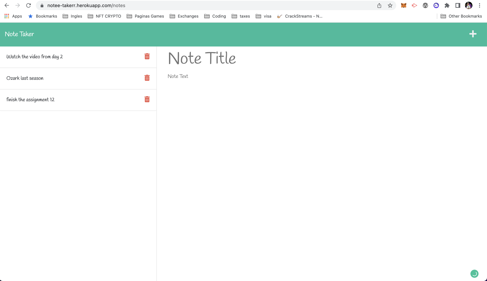

# Note-Taker-App

https://github.com/FadesOner/Note-Taker-App

# Description

This app allows the user to write, save and delete notes.
using the methods GET, POST and DELETE, also using our own api.

# Table of contents
- Description
- Instalation
- Usage
- License
- Technologies
- Contact
- Image link
- Website link
-

# Instalation

The following dependencies must be install in order for the app to work : Inquirer , uuid
You will also need Node.js, express.js
to start the server you need to npm start

# Usage

In order to use the app you need to click on the button get started, once you're on the next page, you can add a title, add a text and saved it by clicking on the save button on the top right. this will show the note on the left side to delete it, go to the left side next to the note you will see a button to delete the note. if you want to add a new note go to the new note go to the plus button on the top right.

# License

This project is not licensed.

# Technologies

- Html
- CSS
- Bootstrap
- JavaScript
- Node.js
- Express.js
- Inquirer 
- Uuid

# Contact

This was created by https://github.com/FadesOner, if you have any enquiry do not hesitate to emailing me at: luisdebourgm@gmail.com

# Image link

# Website link
Please check it out at this link.
https://notee-takerr.herokuapp.com/